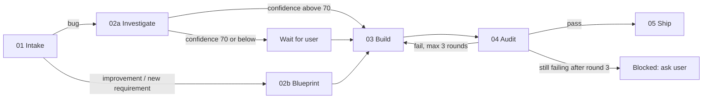

# Ticketflow

## 1. What is Ticketflow

Ticketflow is a Cursor workflow that takes a Jira ticket from intake to a raised pull request with one command. It classifies the ticket, investigates or plans, builds, audits the result with scores, and ships a branch and PR, recording every step in a resumable run file.

## 2. Flow diagram



## 3. Prerequisites

| Requirement | Why | How to set it up |
|-------------|-----|------------------|
| Jira/Atlassian plugin, authenticated | Intake reads the ticket | Install the Atlassian plugin in Cursor and sign in when prompted |
| `cursor-team-kit` plugin | Audit runs `thermo-nuclear-code-quality-review` | Install `cursor-team-kit` from the Cursor plugin marketplace |
| UI skills from `emilkowalski/skills` | Build and Audit use `emil-design-eng`, `animate`, `break-ui`, `review-animations` | `npx skills@latest add emilkowalski/skills` |
| `git` and GitHub CLI, or the GitHub MCP | Ship pushes and raises the PR | `gh auth login` |
| A runnable dev environment | Audit verifies the change live | Make sure the repo's dev server starts (for example `npm run dev`) |

## 4. Quick start

```text
/ticketflow PROJ-123
```

You will see:

1. The ticket summary and its classification, with a one-sentence reason.
2. Questions, if anything is unclear. Ticketflow waits for your answers.
3. A root cause with a confidence score (bugs) or an implementation plan (everything else).
4. Build progress, with each task ticked off, followed by check results and performance notes.
5. Audit scores for functionality, UI/UX, and code quality.
6. A one-line progress update between steps, for example `Step 03 Build complete → starting Step 04 Audit`.
7. The link to the raised pull request.

## 5. Commands

| Command | Step | What it does | When to run it alone |
|---------|------|--------------|----------------------|
| `/ticketflow <TICKET>` | All | Creates or resumes the run and executes every step in order | The normal way to work a ticket |
| `/ticketflow <TICKET> --status` | None | Prints the run summary and resume hint; does no work | To check where a run is |
| `/ticketflow <TICKET> --from <step>` | Any | Restarts from `intake`, `investigate`, `blueprint`, `build`, `audit`, or `ship` | To redo a step after changing your mind |
| `/tf-intake <TICKET>` | 01 Intake | Fetches and classifies the ticket, creates `RUN.md` | To triage a ticket without starting work |
| `/tf-investigate <TICKET>` | 02a Investigate | Read-only root-cause analysis with a confidence score | To diagnose a bug without fixing it yet |
| `/tf-blueprint <TICKET>` | 02b Blueprint | Read-only implementation plan | To get a plan reviewed before building |
| `/tf-build <TICKET>` | 03 Build | Implements the plan, runs checks and a production build | After editing the plan by hand, or to apply audit findings |
| `/tf-audit <TICKET>` | 04 Audit | Scores the change and runs the code quality review | After making manual changes you want re-scored |
| `/tf-ship <TICKET>` | 05 Ship | Creates the branch, commits, pushes, raises the PR | When you have reviewed the work and want the PR |

Each `/tf-*` command refuses to start if its prerequisite step is not done, and tells you which command to run first.

## 6. Step-by-step walkthrough

### Step 01: Intake

- **Input:** the ticket key.
- **Does:** fetches the summary, description, acceptance criteria, comments, attachments, linked issues, priority, labels, reporter, and assignee; classifies the ticket as `bug`, `improvement`, or `new-requirement`.
- **Output:** `RUN.md` with the Intake section and the base branch recorded.
- **Gate:** if the ticket is too thin to classify, Ticketflow asks you first.

### Step 02a: Investigate (bugs)

- **Input:** the Intake section.
- **Does:** asks any questions first, then traces the failing path, checks `git log` and `git blame` on suspect files, and reads existing tests. Read-only.
- **Output:** root cause with `file:line` evidence, a confidence score out of 100, rejected alternatives, and a fix plan.
- **Gate:** confidence above the threshold (default 70) proceeds automatically; otherwise Ticketflow waits for your approval.

### Step 02b: Blueprint (improvements and new requirements)

- **Input:** the Intake section.
- **Does:** asks any questions first, then writes a plan: Goal, Scope, Out of scope, Affected files and modules, Data/API changes, UI spec, Ordered implementation tasks, Test plan, Risks and mitigations, and an Acceptance-criteria → task mapping. Read-only.
- **Output:** the plan in `RUN.md`.
- **Gate:** proceeds once every question is answered and the plan is complete.

### Step 03: Build

- **Input:** the task checklist from Step 02, or the open findings from a failed Audit (fix mode).
- **Does:** detects the stack, implements tasks one at a time (ticking each in `RUN.md`), adds tests, applies the performance checklist, runs lint, typecheck, tests, and a production build, and compares against the base branch. Does not commit.
- **Output:** working tree changes and a Performance notes block.
- **Gate:** checks must pass.

### Step 04: Audit

- **Input:** the diff against the base branch.
- **Does:** scores functionality and UI/UX out of 10, verifies live with the browser tool where possible, and runs the thermo-nuclear code quality review.
- **Output:** a row in the Audit table and, on failure, a prioritized list of open findings.
- **Gate:** see [Audit scoring](#8-audit-scoring).

### Step 05: Ship

- **Input:** a passed audit (or your explicit override).
- **Does:** discovers the branching rules, syncs the base branch, creates the branch, commits, pushes, and raises the PR.
- **Output:** the PR link, recorded in `RUN.md`.
- **Gate:** stops and asks if the base cannot be fast-forwarded or the stash does not apply cleanly.

## 7. Run file and resuming

Every run lives in `.cursor/ticketflow/<TICKET>/RUN.md`. It holds the step states, scores, branches, each step's summary, open questions, and a one-line resume hint. The folder is git-ignored, so runs are never committed.

- **Resume:** run `/ticketflow <TICKET>` again. Ticketflow continues from the first step that is not `done` or `skipped`. Inside Build, it continues from the first unticked task.
- **Waiting or blocked:** if the run is `waiting-for-user` or `blocked`, Ticketflow shows the pending question or the remaining findings and waits for you.
- **`--from <step>`:** resets that step and every later step to `pending` and restarts there.
- **`--status`:** prints the summary and the resume hint without doing any work.
- **No ticket key:** every command falls back to the most recently updated run.

## 8. Audit scoring

**Functionality (0 to 10)**

| Criterion | Weight |
|-----------|--------|
| Acceptance-criteria coverage | 40% |
| Edge cases and error handling | 20% |
| Tests added and passing | 20% |
| Regression risk and live verification | 20% |

Backend performance (latency, query count and N+1, blocking calls, memory) is also checked here.

**UI/UX (0 to 10)**: visual consistency with the design system, loading, empty, and error states, responsive behavior, accessibility, motion quality, and frontend performance. If the change has no UI, UI/UX is recorded as `n/a` and does not block.

**Thermo-nuclear (pass or fail)**: `pass` means the `thermo-nuclear-code-quality-review` skill found no presumptive blockers.

**Pass condition:** functionality at least 8, UI/UX at least 8 (or `n/a`), and thermo-nuclear `pass`. Every deduction must cite a `file:line` or a screenshot.

**Round cap:** a failed audit sends the open findings back to Build in fix mode, then audits again. After 3 failed rounds the run is set to `blocked` and Ticketflow asks you how to proceed.

## 9. Branching and PRs

Ship looks for the repo's own rules first, in this order:

1. `CONTRIBUTING.md`
2. `README`
3. `docs/`
4. `.cursor/rules/`
5. `.github/PULL_REQUEST_TEMPLATE*`
6. commitlint and husky configs
7. the naming pattern of existing remote branches (`git branch -r`)

If a rule is found, Ship follows it exactly. If none is found, it uses this default and says so in the PR body:

| Ticket type | Branch prefix | Example commit |
|-------------|---------------|----------------|
| `bug` | `bugfix/` | `fix(PROJ-123): handle empty session redirect` |
| `improvement` | `improvement/` | `refactor(PROJ-123): <summary>` |
| `new-requirement` | `feature/` | `feat(PROJ-123): <summary>` |

Branch names follow `<prefix>/<TICKET>-<kebab-case-summary>` and are kept to about 60 characters. Commits use Conventional Commits with the ticket key. Ship never force-pushes and never merges the PR.

## 10. Plan mode note

Steps 02a Investigate and 02b Blueprint are designed for Cursor Plan mode. A command cannot switch modes for you, so start those steps in Plan mode (Shift+Tab), or switch when Ticketflow reminds you. Both steps stay read-only either way.

## 11. Customizing

All thresholds are defined once, in the Thresholds table of [.cursor/skills/ticketflow-shared/SKILL.md](.cursor/skills/ticketflow-shared/SKILL.md). Change them there.

| What | Default | Where to change it |
|------|---------|--------------------|
| Investigate confidence gate | 70 | `CONFIDENCE_GATE` in `ticketflow-shared` |
| Audit pass score | 8 | `AUDIT_PASS_SCORE` in `ticketflow-shared` |
| Audit round cap | 3 | `MAX_AUDIT_ROUNDS` in `ticketflow-shared` |
| Default branch prefixes | `bugfix/`, `improvement/`, `feature/` | Step 2 of the Procedure in [.cursor/skills/ticketflow-ship/SKILL.md](.cursor/skills/ticketflow-ship/SKILL.md), or add a branching rule to the repo (it takes precedence) |
| Default UI stack | shadcn/ui + Tailwind CSS | Global rule 5 in `ticketflow-shared` (the repo's existing UI stack always wins) |

## 12. Troubleshooting and FAQ

**Jira tools not found.** Intake stops when no Jira/Atlassian tools are available. Install or re-authenticate the Atlassian plugin in Cursor, then run `/tf-intake <TICKET>` again.

**`gh` is not authenticated.** Run `gh auth login`, or enable the GitHub MCP. If the branch was already pushed, run `/tf-ship <TICKET>` again to raise the PR.

**The pull is not fast-forward.** Ship stops instead of merging or rebasing. Your changes may still be in `git stash list`. Bring the base branch up to date yourself (or tell Ticketflow how to proceed), restore the stash, then run `/tf-ship <TICKET>` again.

**The run is stuck in `waiting-for-user`.** Run `/ticketflow <TICKET> --status` to see the pending question or approval. Answer it in the chat, then run `/ticketflow <TICKET>` to continue.

**The run is `blocked`.** This happens after the audit round cap, a failing check that cannot be fixed within scope, or an unexpected error. Read the summary and open findings with `--status`, then either fix it by hand and run `/tf-audit <TICKET>`, restart with `--from <step>`, or tell Ticketflow to ship anyway (the override is recorded in `RUN.md`).

**Will Ticketflow write to Jira?** No, unless you explicitly ask it to.

## 13. Performance

**Stack detection.** Before writing code, Build reads the project's manifests and config (for example `package.json`, lockfiles, `pyproject.toml`, `go.mod`, framework config files) and records the language, framework and version, rendering model, data layer, build tool, and platform. It never assumes React.

**What Build enforces.** The universal principles in [.cursor/skills/ticketflow-build/performance.md](.cursor/skills/ticketflow-build/performance.md) (measure first, do less work, avoid waterfalls and N+1, cache correctly, bound everything, ship less, clean up), plus the best practices of the detected stack. It only uses features the installed versions support; if a technique needs a newer version, it uses the repo's existing equivalent and tells you. For stacks without a profile, it applies that stack's official guidance.

**Example stack profiles.**

| Stack | Examples of what is applied |
|-------|----------------------------|
| React / Next.js | Server Components by default, `Suspense` with skeletons, `useOptimistic` and `useTransition` (React 19+), `next/image`, `next/font`, `next/dynamic` |
| Vue / Nuxt | `computed` over watchers, `shallowRef`, `defineAsyncComponent`, parallel `useAsyncData` |
| Angular | `OnPush` and signals, `@defer`, `trackBy`, `NgOptimizedImage` |
| Node.js | No event-loop blocking, `Promise.all`, pooling, batching to prevent N+1 |
| Python | `select_related` / `prefetch_related`, no blocking calls in async handlers, background workers |
| Mobile | FlashList, `const` widgets, keeping the main thread free |

**Targets.**

| Area | Target |
|------|--------|
| Frontend | LCP ≤ 2.5 s, INP ≤ 200 ms, CLS ≤ 0.1, no long tasks over 50 ms; flag route growth over about 10 KB gzipped |
| Backend | p95 latency for affected endpoints, no N+1, no blocking calls on hot paths |
| Mobile | Frame rate, startup time, memory |

Build records the measurements against the base branch in the Performance notes block of `RUN.md`, and says so when something cannot be measured.

**How Audit checks it.** Frontend performance is part of the UI/UX score, and backend performance is part of the functionality score. Any clear violation of the checklist without a reason recorded in the Performance notes is a deduction.
