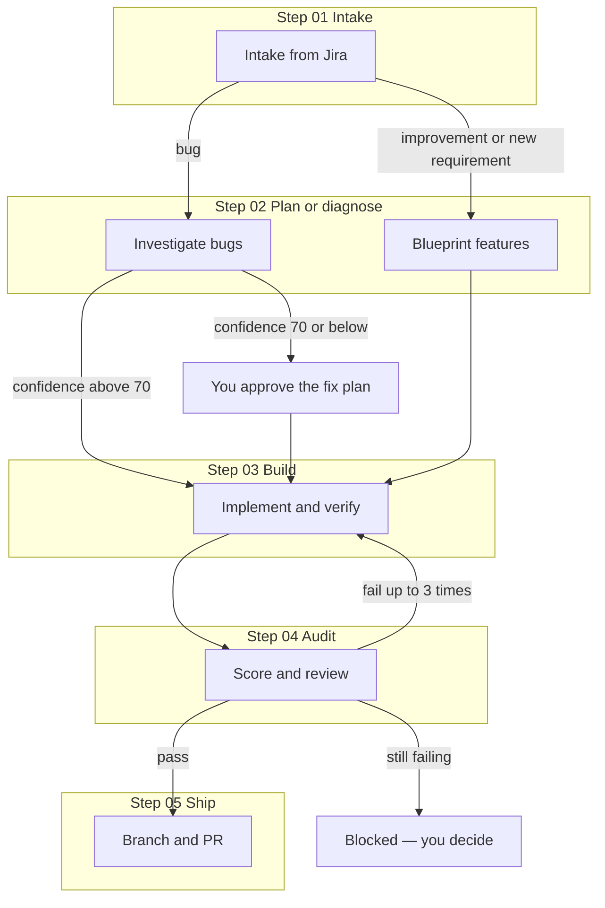

# Ticketflow — user guide

Ticketflow is a Cursor workflow for working Jira tickets end to end: one command fetches the ticket, plans or investigates, implements the change, reviews it with scores, and opens a pull request. You can run the whole pipeline at once or run any step on its own, and if something stops mid-way you pick up where you left off.

This guide explains **how Ticketflow works**, **how to use it**, and **what to do when something goes wrong**. The agent logic lives under `.cursor/commands/` and `.cursor/skills/`; you normally only need this file and the commands below.

---

## How Ticketflow works

### The big picture

Every ticket gets a **run**. A run is a folder on disk that holds state and notes:

```text
.cursor/ticketflow/<TICKET>/RUN.md
```

That file is **not committed to git** (run folders are ignored). It records:

- Ticket type: **bug**, **improvement**, or **new requirement**
- Which steps are done, in progress, or skipped
- Summaries from each step (intake, plan or root cause, build tasks, audit scores, PR link)
- **Open questions** when Ticketflow needs you
- A one-line **resume hint** telling the agent what to do next

When you run `/ticketflow PROJ-123` again, the agent reads `RUN.md`, finds the first incomplete step, and continues. You do not have to remember where you stopped.

### What you see in the agent window

The parent agent keeps a five-step checklist in the agent panel: Intake, Investigate or Blueprint, Build, Audit, Ship. The step that is running is marked in progress. Finished steps are marked done. A skipped path is cancelled. The chat also prints one line when a step hands off, for example `Step 03 Build complete → starting Step 04 Audit`.

Investigate, Blueprint, and Build each run as their own nested agent, so those steps show up as separate runs. Audit stays in the parent, and the thermo-nuclear review is its own nested agent. Intake and Ship stay in the parent. Only the parent writes `RUN.md`.

If Ticketflow is waiting on you or blocked, the current checklist item stays in progress and the chat shows the question. `/ticketflow PROJ-123 --status` still prints the same state from `RUN.md` and does not change the checklist.

### The five steps

| Step | Name | Bug | Improvement / new requirement |
|------|------|-----|--------------------------------|
| 01 | **Intake** | Fetch Jira, classify, create `RUN.md` | Same |
| 02 | **Investigate** or **Blueprint** | Root cause + confidence + fix plan (read-only) | Implementation plan (read-only) |
| 03 | **Build** | Implement tasks, tests, performance checks, lint/build | Same |
| 04 | **Audit** | Score functionality & UI/UX, code-quality review | Same |
| 05 | **Ship** | Branch, commit, push, open PR | Same |



**Gates (where Ticketflow stops for you):**

- **Intake:** ticket too vague to classify → questions, then wait.
- **Investigate (bugs):** confidence **70 or below** → shows findings, waits for your OK before Build.
- **Investigate / Blueprint:** missing repro, scope, or design → questions first, no guessing.
- **Audit:** scores or code review fail → Build again in **fix mode** (only audit findings), then Audit again (max **3** rounds). Still failing → **blocked**, you choose next move.
- **Ship:** cannot fast-forward the base branch → stops; you fix git state, then run Ship again.

Default thresholds (change only in [.cursor/skills/ticketflow-shared/SKILL.md](.cursor/skills/ticketflow-shared/SKILL.md)):

| Setting | Default | Meaning |
|---------|---------|---------|
| `CONFIDENCE_GATE` | 70 | Bug root-cause confidence must be **above** 70 to auto-enter Build |
| `AUDIT_PASS_SCORE` | 8 | Functionality and UI/UX need **≥ 8** (UI/UX can be `n/a` if no UI) |
| `MAX_AUDIT_ROUNDS` | 3 | Audit → Build fix loops, then blocked |

---

## Before you start

Set these up once:

| You need | Why |
|----------|-----|
| **Jira / Atlassian** plugin in Cursor, signed in | Step 01 reads the ticket (read-only; Ticketflow does not update Jira unless you ask) |
| **`cursor-team-kit`** plugin | Step 04 runs the thermo-nuclear code quality review |
| **`gh auth login`** or **GitHub MCP** | Step 05 opens the PR |
| **Dev environment** that runs (e.g. `npm run dev`) | Step 04 checks UI in the browser when possible |
| **UI skills** (optional but recommended) | `npx skills@latest add emilkowalski/skills` — used in Build/Audit for design and motion |

**Start on the branch you want the PR to target** (often `main`). Intake records that branch in `RUN.md` as `base_branch`; Ship opens the PR against it.

**For bug diagnosis and feature planning (Step 02), use Cursor Plan mode** (Shift+Tab). Commands cannot switch modes for you; Step 02 stays read-only either way (no code changes except updating `RUN.md`).

---

## How to use Ticketflow

### Full run (most common)

In Cursor chat (Agent mode), at the repo root:

```text
/ticketflow PROJ-123
```

Replace `PROJ-123` with your Jira key (e.g. `SLOTLY-42`).

What happens:

1. **Intake** — Summary, acceptance criteria, type (`bug` / `improvement` / `new-requirement`), reason in one sentence.
2. **Step 02** — For bugs: questions if needed, then root cause with `file:line` evidence, confidence **out of 100**, and a fix plan. For features: an implementation plan with tasks and an AC → task table.
3. **Build** — Tasks ticked off in `RUN.md`, lint/typecheck/tests and production build when the repo supports them, performance notes for your stack.
4. **Audit** — Functionality **0–10**, UI/UX **0–10** (or `n/a`), thermo-nuclear **pass/fail**; screenshots for UI when possible.
5. **Ship** — Branch name follows **this repo’s** rules if they exist (e.g. `.cursor/rules/branching.mdc`), else Ticketflow defaults; commit, push, PR link.

Between steps you’ll see a short line like: `Step 03 Build complete → starting Step 04 Audit`.

### Check status without doing work

```text
/ticketflow PROJ-123 --status
```

Shows step states, scores, open questions, and the **resume hint**.

### Resume after a break or failure

```text
/ticketflow PROJ-123
```

Same command. If status is `waiting-for-user`, answer the question in chat, then run it again. If you were mid-Build, the agent continues from the first unchecked task in `RUN.md`.

### Restart from a specific step

```text
/ticketflow PROJ-123 --from build
```

Allowed values: `intake`, `investigate`, `blueprint`, `build`, `audit`, `ship`. That step and later ones reset to pending (skipped steps stay skipped).

### Run one step only

Use when you want control (review the plan before Build, re-audit after manual edits, etc.):

| Command | When to use it |
|---------|----------------|
| `/tf-intake PROJ-123` | Triage only; creates `RUN.md` |
| `/tf-investigate PROJ-123` | Bug root-cause only (Plan mode recommended) |
| `/tf-blueprint PROJ-123` | Feature plan only (Plan mode recommended) |
| `/tf-build PROJ-123` | Implement after you approved the plan, or after failed audit |
| `/tf-audit PROJ-123` | Re-score after changes |
| `/tf-ship PROJ-123` | Open PR after audit passed (or you explicitly override in `RUN.md`) |

If you omit the ticket key, Ticketflow uses the **most recently updated** run under `.cursor/ticketflow/`.

Each step command **refuses** to run if the previous required step isn’t done and tells you which command to run first.

---

## What each step does (detail)

### 01 — Intake

- Pulls from Jira: summary, description, acceptance criteria, comments, links, labels, etc.
- Classifies the ticket and writes **01 Intake** in `RUN.md`.
- Does **not** invent acceptance criteria; if the ticket has none, that becomes an open question for Step 02.

### 02a — Investigate (bugs only)

- **Read-only:** no application code edits.
- Asks about repro, environment, expected behavior if unclear.
- Explores the codebase, `git log` / `git blame`, tests.
- Writes: root cause, **confidence N/100**, alternatives ruled out, fix plan as a checklist copied into **03 Build**.
- **Above 70 confidence:** continues to Build. **70 or below:** waits for your approval.

### 02b — Blueprint (improvements & new requirements)

- **Read-only** with the same ask-first rule.
- Plan sections: Goal, Scope, Out of scope, Affected files, Data/API, UI spec (repo conventions first; default shadcn + Tailwind if unspecified), ordered tasks, test plan, risks, **AC → task** table.
- When complete, continues to Build.

### 03 — Build

- Executes the checklist; ticks tasks in `RUN.md`.
- Detects **your project’s stack** (not assumed React); applies [.cursor/skills/ticketflow-build/performance.md](.cursor/skills/ticketflow-build/performance.md).
- UI: loading, empty, error states, a11y, responsive layout when there is UI.
- Runs repo scripts (lint, test, production build) when they exist; records **Performance notes** in `RUN.md`.
- **Does not commit** — commits happen in Ship.
- **Fix mode:** after a failed audit, only addresses **Open findings** in `RUN.md`.

### 04 — Audit

Reviews the diff against `base_branch`:

1. **Functionality (0–10)** — AC coverage, edge cases, tests, live/test verification; backend performance where relevant.
2. **UI/UX (0–10)** — design system, states, responsive, a11y, motion, frontend performance; **`n/a`** if no UI.
3. **Thermo-nuclear** — `cursor-team-kit` code quality review on branch changes.

**Pass:** functionality ≥ 8, UI/UX ≥ 8 or `n/a`, thermo-nuclear pass → Ship.  
**Fail:** prioritized findings → Build (fix mode) → Audit again (max 3 rounds).

### 05 — Ship

- Discovers branching/commit rules from CONTRIBUTING, README, `.cursor/rules`, PR templates, remote branch names.
- `git fetch`, fast-forward base if needed (stops and asks if not possible).
- Creates branch, commits (never includes `.cursor/ticketflow/`), pushes, opens PR with template or standard sections (ticket link, summary, root cause for bugs, test notes, audit scores, screenshots).
- **Never** force-pushes or merges the PR.

---

## The run file (`RUN.md`)

Example location:

```text
.cursor/ticketflow/SLOTLY-42/RUN.md
```

Useful frontmatter fields:

- `status`: `in-progress` | `waiting-for-user` | `blocked` | `done`
- `current_step`, `steps.*`, `confidence` (bugs), `audit_round`, `scores`, `base_branch`, `work_branch`, `pr_url`

Sections hold human-readable summaries; **Resume hint** is the single line the agent uses to continue.

You can edit `RUN.md` by hand (e.g. tweak the task list before `/tf-build`) — keep frontmatter valid YAML.

---

## Audit scoring (what “pass” means)

| Check | Pass condition |
|-------|----------------|
| Functionality | ≥ 8 / 10 (deductions need evidence: file:line or test output) |
| UI/UX | ≥ 8 / 10, or **`n/a`** when there is no UI |
| Thermo-nuclear | **pass** (no presumptive blockers from that review) |

Failed audit → findings list in `RUN.md` → Build fix mode → re-audit. After **3** failed rounds, status **`blocked`**; you fix manually, override and ship, or `--from build`.

---

## Branching and PRs

Ship **always looks for repo rules first**. In this repository, [.cursor/rules/branching.mdc](.cursor/rules/branching.mdc) expects branches like `fix/SLOTLY-42-short-slug` or `feature/SLOTLY-46-short-slug`. Ticketflow maps **bug → fix**, **improvement / new requirement → feature**, and uses the ticket key from Jira.

If no rule exists anywhere, defaults are:

- `bugfix/`, `improvement/`, or `feature/` + ticket + kebab summary
- Conventional Commits including the ticket id, e.g. `fix(PROJ-123): …`

PRs should follow [.cursor/rules/pr-model-attribution.mdc](.cursor/rules/pr-model-attribution.mdc) when that rule applies (model, effort, fast mode lines in the description).

---

## Troubleshooting

| Problem | What to do |
|---------|------------|
| Jira tools missing | Install/authenticate Atlassian in Cursor → `/tf-intake PROJ-123` |
| Stuck on questions | `/ticketflow PROJ-123 --status` → answer in chat → `/ticketflow PROJ-123` |
| Low bug confidence | Review Investigate section; approve in chat or give direction → Build |
| Audit keeps failing | Read **Open findings**; fix or `/tf-build`; after 3 rounds, status is `blocked` — you decide |
| `gh` not logged in | `gh auth login`, or use GitHub MCP → `/tf-ship PROJ-123` if branch already pushed |
| Pull not fast-forward | Ship stops; check `git stash list`, update base, restore work, `/tf-ship` again |
| Thermo-nuclear unavailable | Install `cursor-team-kit`; audit treats review as fail until it runs |
| UI skills missing | `npx skills@latest add emilkowalski/skills`; Build/Audit still run with shadcn + Tailwind fallback |

Ticketflow **will not** force-push, merge PRs, commit secrets, commit run folders, or write to Jira unless you explicitly ask.

---

## Customization

Edit thresholds once in [.cursor/skills/ticketflow-shared/SKILL.md](.cursor/skills/ticketflow-shared/SKILL.md) (`CONFIDENCE_GATE`, `AUDIT_PASS_SCORE`, `MAX_AUDIT_ROUNDS`).

Default UI stack when the ticket/repo is silent: **shadcn/ui + Tailwind**; existing repo patterns always win.

Performance rules: [.cursor/skills/ticketflow-build/performance.md](.cursor/skills/ticketflow-build/performance.md) (detect stack first, universal principles, stack-specific examples, verification vs base branch).

---

## Quick reference

```text
/ticketflow PROJ-123              # full run or resume
/ticketflow PROJ-123 --status     # read run state only
/ticketflow PROJ-123 --from audit # redo from audit onward

/tf-intake PROJ-123
/tf-investigate PROJ-123   # bugs; Plan mode
/tf-blueprint PROJ-123     # features; Plan mode
/tf-build PROJ-123
/tf-audit PROJ-123
/tf-ship PROJ-123
```

**Orchestrator command file:** [.cursor/commands/ticketflow.md](.cursor/commands/ticketflow.md)  
**Shared rules and RUN schema:** [.cursor/skills/ticketflow-shared/SKILL.md](.cursor/skills/ticketflow-shared/SKILL.md)
